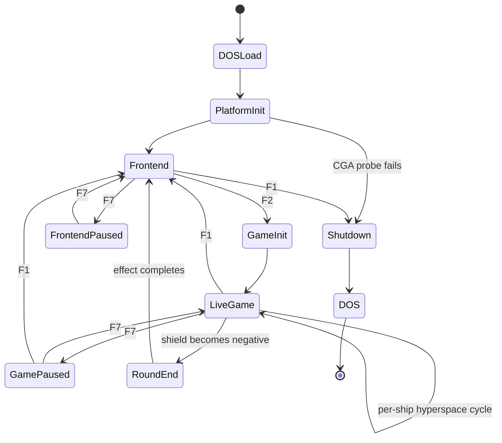
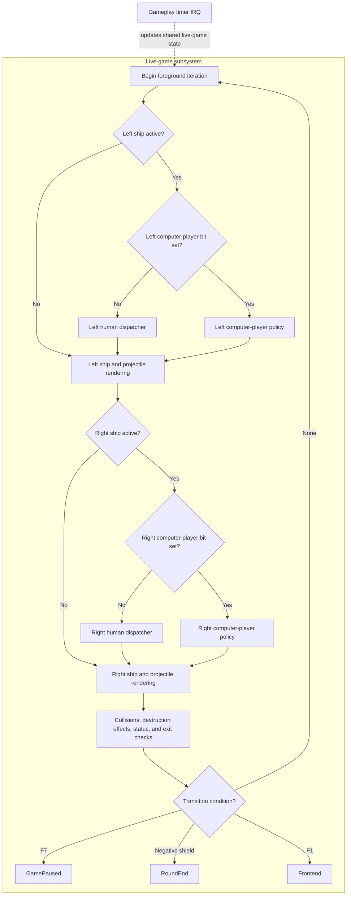
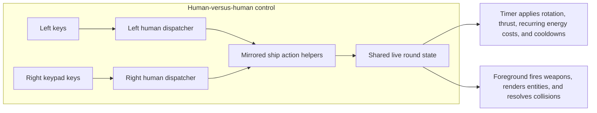
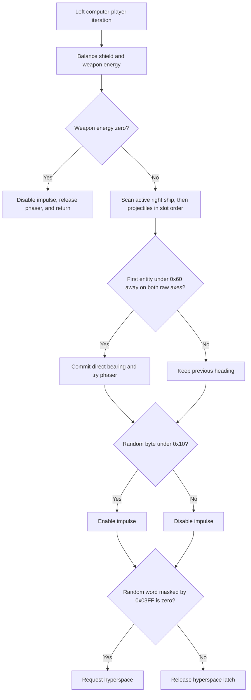
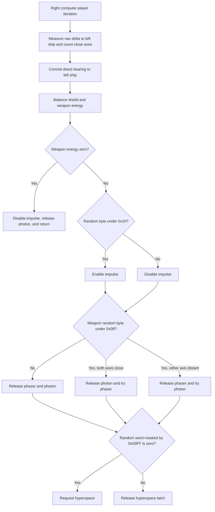

# Phase 6 Findings: Architecture Reconstruction

## Status

Phase 6 is complete. The executable is a self-contained, assembly-oriented DOS program with two principal application modes, three execution contexts, one shared state image, and no conventional frame scheduler. A persistent keyboard interrupt handler records raw key state, one of two timer handlers owns fixed-rate work, and an unpaced foreground path owns screen sequencing or gameplay decisions, collision resolution, and XOR rendering.

The failure-path audit did not identify a reproducible gameplay crash. It did identify one startup portability weakness caused by the initial wrapped stack, one deliberate warm-restart path, and the earlier debugger failure signature. A bounded low-memory probe did not turn the startup weakness into a failure under the investigated emulator configuration, so no further debugger run is justified without a new, specific symptom.

## Evidence and address convention

This reconstruction correlates:

- the MZ header and startup disassembly from Phase 1;
- the static control-flow, interrupt, rendering, and data maps from Phase 2;
- the runtime entry, timer-vector, input, and shutdown observations from Phase 3;
- the focused Ghidra mappings and random/title/background results from Phase 4; and
- the normalized player and computer-player policies from Phase 5.

Addresses written as `CS:xxxx` are offsets within the program's code segment and remain stable between launches. `DS:xxxx` addresses are offsets from the relocated load-module base. The MZ header is `0x200` bytes and the code segment begins at load-module offset `0x2AB0`:

```text
file offset       = load-module offset + 0x0200
runtime CS offset = load-module offset - 0x2AB0
```

Names in this document are evidence-backed investigation names, not recovered original symbols.

## Architectural summary

The design is compact but deliberately layered:

1. A platform layer validates CGA memory, installs interrupt handlers, reprograms the PIT, manages a private stack, and restores DOS-visible state at exit.
2. A frontend layer runs an attract/information carousel in the foreground while its timer handler animates the planet and processes F1 through F8.
3. A gameplay foreground loop evaluates human or computer-player controls, maintains XOR-render state, resolves collisions and phaser rays, advances destruction effects, and decides round or mode transitions.
4. A gameplay timer handler advances fixed-rate motion, resources, cooldowns, hyperspace effects, the planet, and speaker state.
5. A data-oriented state layer represents ships and projectiles as parallel arrays selected by one even byte index.

The foreground and timer are intentionally different clocks. A foreground iteration is one complete pass through the current foreground loop; it is not a video frame and is not synchronized to the PIT. The timer runs at approximately 72.8 Hz. Consequently, computer-player decisions and some energy-transfer helpers may run several times while the timer byte has one value, while position and cooldown changes remain timer paced.

## Application state model



Ctrl-Alt-Delete is an out-of-band transition available whenever the keyboard handler is active. It writes the BIOS warm-boot marker and transfers to the reset vector rather than entering the normal shutdown state.

### Live-game expansion

`LiveGame` is a cooperative subsystem rather than a single undivided state. Each foreground iteration selects one complete control path for the left ship, renders the left-side entities, selects one complete control path for the right ship, renders the right-side entities, and then performs the shared collision, effect, status, and transition work. The gameplay timer can interrupt this foreground work to update the same round state.



The gameplay timer's shared-state updates cover motion, resources, cooldowns, hyperspace, planet animation, and audio.

The two mode bits are independent. The detailed blocks below replace the corresponding human dispatcher without changing the rest of the live-game pipeline.

| `DS:1076` bits 1..0 | Left control block | Right control block |
|---:|---|---|
| `00` | Human | Human |
| `01` | Computer player | Human |
| `10` | Human | Computer player |
| `11` | Computer player | Computer player |

#### Human-versus-human control block

With both mode bits clear, the foreground reads the shared keyboard-state table through the left dispatcher at `CS:0259` and then the right dispatcher at `CS:04B0`. The dispatchers sample the current held-key states once per foreground iteration; action helpers and timer-paced resource rules determine whether each requested effect can occur.



| Action | Left key | Right key | Requested effect |
|---|---:|---:|---|
| Rotate clockwise | `D` | keypad `6` | Store rotation command `+2` |
| Rotate counter-clockwise | `A` | keypad `4` | Store rotation command `-2` |
| Weapon to shield | `C` | keypad `3` | Transfer one unit while the shared tick is divisible by four |
| Shield to weapon | `Z` | keypad `1` | Transfer one unit while the shared tick is divisible by four |
| Phaser | `Q` | keypad `7` | Spend one weapon unit and start the phaser when ready |
| Photon | `E` | keypad `9` | Spend one weapon unit and allocate a free projectile when its latch permits |
| Impulse | `S` | keypad `5` | Set action-flag bit 0; the timer applies thrust and recurring cost |
| Cloak | `W` | keypad `8` | Set action-flag bit 1; the timer applies recurring cost and foreground drawing omits the ship |
| Hyperspace | `X` | keypad `2` | Spend eight weapon units and start hyperspace when its latch permits |

F1 returns the round to the frontend, F7 pauses or resumes play, and F8 toggles sound. These are round-wide live-game controls rather than actions belonging to either ship.

#### Left computer-player control block

When mode bit 0 is set, `CS:038E` replaces the left human dispatcher with a proximity-defense policy. It can target the right ship or the right projectile pool, but it never requests photon fire or cloak.



The right ship has target priority because its slot is scanned first. If it is not close, the first close active right projectile wins. With no qualifying target, random impulse and hyperspace decisions still occur.

#### Right computer-player control block

When mode bit 1 is set, `CS:05E5` replaces the right human dispatcher with a pursuit policy. It always calculates a direct bearing to the left ship and can select either weapon, but it never requests cloak.



Both computer-player blocks run at foreground speed and reuse the same side-specific action helpers as human control. Their direct bearing updates replace gradual rotation commands. The timer later applies impulse and recurring costs, while the foreground performs weapon creation or tracing, rendering, and collision work. When both computer players are enabled, the left policy runs first and consumes its shared random values before the right policy runs.

### Frontend pause

Frontend pause stops the foreground carousel at calls to `CS:1895`, but the frontend timer continues. The timer can therefore observe F7 again, update option latches, maintain BIOS time, and animate the enabled planet while the carousel is paused.

### Gameplay pause

Gameplay pause changes both contexts. The foreground stops at its key-polling tail, silences the speaker, and continues to accept F1, F7, and F8. The gameplay timer increments the shared tick and preserves BIOS time, then skips ship, entity, resource, hyperspace, and sound work. It still reaches the periodic planet-animation tail.

### Hyperspace and destruction

Hyperspace and destruction are per-entity substates rather than separate top-level modes. Hyperspace makes one ship inactive for ordinary control and uses the shared particle arrays until the timer restores it at new bounded coordinates. A negative entity state is consumed by the foreground destruction-effect loop until that slot is cleared or restored by the relevant transition.

## Startup and platform lifecycle

### DOS entry and initialization

At `CS:0000`, the program performs this ordered sequence:

1. Save the DOS-provided data/PSP segment for the eventual termination transfer, then load the relocated program data segment into `DS`.
2. Query the current video mode with BIOS interrupt `10h` and remember it.
3. Select `B800`, write and verify words across the expected `0x4000`-byte CGA memory aperture, and take the clean failure path if the test does not round-trip.
4. Adjust BIOS data-area floppy state and write the floppy-controller control port.
5. Disable interrupts, preserve the DOS `SS:SP`, set `SS=DS`, and set the private stack top to `SP=0166`.
6. Save interrupt vectors 8 and 9.
7. Program PIT channel 0 with divisor `4006`, giving approximately 72.8 timer interrupts per second.
8. Install the persistent keyboard handler at `CS:1F80`, then re-enable interrupts.
9. Build the 200-entry CGA scanline table, select BIOS video mode 6, seed the five-byte random generator from the BIOS tick count, enable sound state, and enter the frontend at `CS:0940`.

The header declares initial `SS:SP=0000:0000`. The early video BIOS call therefore uses normal 16-bit stack wrap at offsets just below `FFFF` before step 5 establishes the private stack. This works in the observed runs but is discussed as a portability weakness in the failure audit.

### Normal shutdown

Normal exit at `CS:0095` is symmetric with startup:

1. Disable interrupts.
2. Restore interrupt vectors 8 and 9 and restore PIT channel 0's conventional divisor.
3. Restore the DOS stack.
4. Re-enable interrupts and restore the original video mode.
5. Use the saved PSP-based termination path to return to DOS.

Phase 3 dynamically confirmed the frontend F1 transition, both restored vectors, the PIT-restoration routine, and normal termination.

## Execution contexts and scheduling

| Context | Active lifetime | Principal responsibilities | Completion mechanism |
|---|---|---|---|
| DOS foreground | Entire process | Startup, frontend carousel, gameplay decisions/rendering/collisions, transitions, shutdown | Calls, jumps, and polling loops |
| Keyboard IRQ 1, `CS:1F80` | After startup until shutdown | Record make/break byte in the 128-byte table; acknowledge controller and PIC; recognize Ctrl-Alt-Delete | `IRET`, except deliberate reset |
| Timer IRQ 0, `CS:172D` | Frontend | Shared tick, BIOS time, planet animation, F1-F8 option processing, F1/F2 transitions | `IRET` or non-local transition |
| Timer IRQ 0, `CS:233D` | Gameplay | Motion, resources, cooldowns, hyperspace, planet, and PC-speaker update | `IRET` |

Only one timer handler is installed at a time. The keyboard handler persists while vector 8 changes from the BIOS handler to the frontend handler and then to the gameplay handler.

### Interrupt discipline

- Hardware entry clears the interrupt flag. Neither timer handler enables nested hardware interrupts during its ordinary update path.
- The frontend timer acknowledges the PIC near its start; the gameplay timer acknowledges it at the common exit.
- The frontend F2 and F1 checks occur after its early acknowledgement. Their targets deliberately abandon the saved interrupt frame and reset or restore the stack instead of returning through it.
- Render snapshots use `PUSHF`, `CLI`, and `POPF`, preserving the caller's original interrupt state.
- Entity activation/deactivation uses short `CLI`/`STI` regions. Collision scanning itself runs with interrupts enabled, so the timer may update positions between separate foreground reads.

That last property permits a timing-dependent mixed X/Y observation, but the values still come from valid slots and bounded coordinate ranges. It can change one decision or collision result; it does not provide an out-of-bounds index.

## Frontend architecture

Frontend entry at `CS:0940` resets the private stack, clears pause, silences the speaker, resets the raw keyboard table, installs the frontend timer, clears the framebuffer, draws a new 512-attempt random background, and draws the option row.

Its foreground then cycles indefinitely through:

- title and copyright;
- the 90-tile `SPACEWAR` disperse-and-reassemble animation;
- player key assignments;
- game instructions; and
- the distribution information screen.

The long-lived random background is not stored. The 90 title tiles use six mutable fixed-point arrays plus fixed positions and glyph selectors. Their outward velocities are negated and applied for the same number of foreground frames, which exactly reassembles the title.

The frontend timer owns F1-F8 option handling. Edge-latch bits prevent a held key from toggling repeatedly. F2 is tested before F1, so simultaneous held states choose Play. The F2 target resets `SP`, initializes a round, and replaces vector 8 with the gameplay timer before normal interrupts resume.

## Gameplay architecture

### Round initialization

Game entry at `CS:00BC` resets `SP`, clears pause, copies `0x360` bytes from the embedded template at `DS:0950` into live state at `DS:0CBC`, clears and rebuilds the game screen, resets the keyboard table, and installs `CS:233D` as vector 8.

The round template initializes two ships and fourteen projectile slots. Session-level values outside that copy, including the shared tick and score fields, can persist across round/front-end transitions.

### One foreground iteration

The live loop at `CS:00CD` performs this ordered work as quickly as the processor or emulator permits:

1. Maintain the timed left phaser display state.
2. If the left ship is active, run human or computer-player controls, honor cloak for ship drawing, and use dirty-state erase/snapshot/redraw logic.
3. Walk left projectile slots `02..0E`, erase expired objects, and redraw dirty active objects.
4. Repeat the corresponding control/render work for the right ship and slots `12..1E`.
5. Resolve ship, projectile, and optional planet collisions at `CS:18A0`.
6. Advance bounded destruction effects for negative entity states.
7. Draw shield/weapon status changes.
8. Test signed shield values and enter the round-end effect if either is negative.
9. Process F1, sound, and pause state, then begin another iteration or remain in the paused polling tail.

Phaser firing is also foreground work. Its action helper snapshots the ship position and angle, traces a wrapped ray, checks bounded entity/planet hits, and stores the drawn length. A later foreground pass retraces the saved ray to erase it without applying damage again.

### Collision ownership

Phase 6 refines an earlier Phase 2 shorthand: ordinary collision resolution is foreground work, not gameplay-timer work. `CS:18A0` handles ship/ship response, four ship-versus-opposing-pool scans, projectile-versus-projectile scans, and optional planet contact. The predicate at `CS:1AB1` first requires positive entity states and then compares absolute raw X/Y differences against caller-provided bounds.

The collision geometry does not use wrapped shortest distances. Objects on opposite edges can therefore be visually close in the wrapped world but fail a raw proximity test. This is a gameplay limitation shared with the computer-player bearing logic, not a memory-safety failure.

### One gameplay timer tick

The handler at `CS:233D` performs:

1. Save nine registers/segments and load the program data segment.
2. Increment the shared tick; every fourth tick, advance the BIOS tick count and daily rollover state.
3. If paused, skip to the planet/interrupt-exit tail.
4. For each active ship, apply rotation command, impulse acceleration and speed limiting, plus periodic impulse/cloak energy costs.
5. Walk all even entity slots `00..1E`; advance split fixed-point positions, wrap them inside the playable border, set render-dirty state, and apply optional gravity.
6. Every 32 ticks, update low-resource status/sound conditions.
7. On tick-byte wrap, recharge eligible nonzero weapon-energy bytes toward their signed maximum.
8. Every 16 ticks, decrement active projectile lifetimes in the two seven-slot pools.
9. Advance phaser cooldowns and update the PC-speaker state machine.
10. Advance any active left/right hyperspace particle effect and restore the ship when its effect completes.
11. Every 16 ticks, animate the enabled planet.
12. Acknowledge the PIC, restore the saved state, and `IRET`.

The timer produces new coordinates, resource values, and dirty flags. The foreground consumes them, but it also produces action flags, projectile activations, damage, and transitions. The architecture is therefore cooperative shared-state concurrency rather than a strict one-way producer/consumer pipeline.

### Gravity calculation

F6 toggles mask `02` in `DS:2040`. While that mask is set, the gameplay timer calls `CS:1E30` once for every positive-state entity immediately after updating and wrapping its position. Ships and projectiles receive the same acceleration; the calculation has no entity mass or type parameter.

The planet and gravity center is integer coordinate `(319, 99)`. For an entity at current integer position `(x, y)`, the routine performs:

```text
dx = x - 319
dy = y - 99

velocity_x_16_16 += -8 * dx
velocity_y_16_16 += -8 * dy
```

The additions go into the low words at `DS:0DDC + slot` and `DS:0DFC + slot`, with sign extension into the high words at `DS:0D9C + slot` and `DS:0DBC + slot`. Interpreting those word pairs as signed 16.16 velocity gives:

```text
change in x velocity = -(x - 319) / 8192 pixels per timer tick
change in y velocity = -(y -  99) / 8192 pixels per timer tick
```

This is a linear restoring field, similar to a two-dimensional spring, rather than inverse-square gravity. Acceleration is zero at the center and grows linearly with axis distance. It needs no square root, division, radial-distance table, or near-center special case. Across the playable coordinate bounds, the raw X component ranges from `+2488` to `-2496` and the Y component from `+728` to `-736`, so the intermediate signed words cannot overflow.

Position is advanced before gravity is added, so the new acceleration affects motion beginning with the next timer tick. There is no gravity-specific velocity cap. The impulse path limits ship thrust contributions, but gravity is added afterward and projectile velocities receive it directly.

For the initial ship positions:

| Ship | Position | Fixed-point velocity change per tick | Direction |
|---|---:|---:|---|
| Left | `(160, 46)` | `(+1272, +424)` | Down and right, toward the planet |
| Right | `(480, 138)` | `(-1288, -312)` | Up and left, toward the planet |

The option bits are independent. Mask `01` controls planet rendering and planet collision, while mask `02` controls gravity. Gravity can therefore act around the invisible center `(319, 99)` when the planet display is disabled.

A softened inverse-square or lookup-table approximation is tracked as proposed edit `EDIT-GRAV-01` in the [potential edits ledger](potential-edits.md). It is a future design candidate, not a change to the current executable or to the architecture described above.

## Data and memory model

### Segment layout

The initialized load-module base is the program's main `DS` and private `SS`. The code segment is `0x02AB` paragraphs above it. Ghidra models these as data base `1000` and code base `12AB`, while actual runtime segment values remain loader dependent.

| `DS:` range or base | Architectural role |
|---|---|
| `0000..0166` | Platform variables plus the downward-growing private stack ending at `0166` |
| `0171..07C4` | Fixed and mutable 90-particle title/round-effect arrays |
| `0950..0CAF` | Embedded round-state template |
| `0CBC..101B` | Live copied round/entity state |
| `1060..1084` | Shared display segment, vectors, options/latches, tick, and scores |
| `1085..1214` | 200-word CGA scanline table |
| `1232..12B1` | 128-byte raw keyboard table |
| `2040..2041` | Planet/gravity flags and planet frame |
| `2050` | Signed trigonometric component table |
| `2250` | 32-word bearing threshold table |
| `2290..2292` | Sound event, phase, and enabled state |
| `22A0` | Character and effect glyph data |
| `2AA0..2AAF` | Five-byte random state plus adjacent scratch/data before code |

### Parallel entity arrays

An even byte index selects one logical entity across parallel arrays:

| Slots | Ownership |
|---|---|
| `00` | Left ship |
| `02..0E` | Seven left projectile slots |
| `10` | Right ship |
| `12..1E` | Seven right projectile slots |

Important array bases include current and previously rendered coordinates (`D1C..D7C`), split fixed-point velocity/integrator words (`D9C..E0C`), dirty state (`E1C`), signed entity state (`E3C`), current/previous angles (`E5C`/`E7C`), action and latch flags (`EBC`/`EDC`), shield energy (`EFC`), and weapon/lifetime/cooldown state (`F1C`). Fields have slot-dependent meanings, especially for ship versus projectile entries.

This structure-of-arrays layout makes the mirrored left/right code compact: adding `10` selects the right ship, while even increments traverse a side's pool. It also explains why the byte immediately after a ship field is normally unused padding rather than another entity.

### Signed state conventions

- Entity state greater than zero means active.
- Entity state zero means inactive or temporarily absent, including hyperspace.
- Negative entity state marks destroyed/free/effect state depending on the accompanying fields.
- Shield sign is the round-loss condition.
- Phaser state `FF` means ready; positive values are a countdown/display state.

Several arrays intentionally reuse bytes across entity types, making proposed high-level types narrower than their physical storage.

## Rendering, input, random, and audio subsystems

### Rendering

The program selects BIOS mode 6, then renders directly into `B800` CGA memory. The scanline table converts Y coordinates into CGA's alternating `0x2000`-byte banks. Sprites and most pixels use XOR, so the same draw operation both displays and erases an object. A dirty object is erased from its previous snapshot, snapshotted under a short interrupt exclusion, and redrawn from current state.

The planet is a separate 16-frame direct writer. Text uses an unusual inline-data convention: `CS:1C82` pops its return address, consumes bytes embedded immediately after the call, pushes the adjusted address, and returns after the data. This saves space but interleaves code and display data and is the main reason broad linear disassembly produces false instructions.

### Input and computer players

The keyboard ISR records the complete make/break byte at `DS:1232 + (scan & 7F)`. Foreground human dispatchers walk nine embedded scan-code bindings and use fixed indirect press/release tables. Frontend options use the same table plus edge latches.

Computer players enter through the same per-side control dispatchers as humans, but they choose actions from live state and the shared random stream. The left policy is proximity defense over the right ship and projectile pool; the right policy pursues the left ship. Both make decisions at foreground speed, both use raw non-wrapped geometry, and neither honors the opponent's cloak bit. Detailed policies and deferred cloak-aware work remain in `analysis/phase-5-findings.md`.

### Random service

One five-byte additive/carry generator serves every consumer. Startup seeds four bytes from the BIOS tick count and retains the initially zero fifth byte. Callers independently interpret the returned word: rejecting coordinate helpers, raw threshold tests, masked hyperspace gates, title velocities, round-effect velocities, or a randomized speaker divisor. Reproducibility therefore depends on both the initial five-byte state and the complete intervening call order.

### Audio

Game events set bits in shared sound state. The gameplay timer calls the PC-speaker state machine, which chooses fixed, swept, alternating, or random divisors and programs PIT channel 2 plus the speaker gate. F8 toggles sound globally; pause and transition paths explicitly silence the gate when needed.

## DOS, BIOS, and hardware dependencies

| Dependency | Use |
|---|---|
| DOS MZ loader and PSP | Relocation, segment setup, allocation, saved termination transfer |
| BIOS video interrupt `10h` | Query original mode, select mode 6, restore original mode |
| BIOS data area at segment `0040` | Tick count/rollover, warm-boot marker, early floppy state |
| DOS interrupt `21h` | Display the startup failure text; normal termination ultimately uses the saved PSP path |
| Interrupt vector table | Save, replace, and restore IRQ 0 and IRQ 1 handlers |
| CGA memory `B800` | Probe and all framebuffer access |
| PIT channels 0 and 2 | Game clock and PC-speaker frequency |
| PIC port `20` | End-of-interrupt acknowledgement |
| Keyboard/controller ports `60` and `61` | Raw scan-code input and controller acknowledgement |
| Floppy-controller port `3F2` | Early platform initialization |

No DOS file-open/read path or external resource reference has been identified. Program text, sprites, glyphs, templates, tables, and sound policies are embedded in the executable.

## Failure-path audit

### Conclusion

No minimal series of ordinary gameplay, input, timing, option, or transition events has been found that reproducibly crashes the game. The static audit found bounds or intentional sentinels on the principal candidate paths, and the controlled runs reached frontend, gameplay, selected actions, and normal shutdown.

The earlier scrolling `CPU: Illegal/Unhandled interrupt` behavior is classified as a debugger/instrumentation failure, not a game failure. It occurred when an entry breakpoint or injected interrupt was not established correctly and execution was observed in BIOS segment `F000`. With the two-byte `INT 03h` workflow, restored entry bytes, confirmed breakpoint list, and runtime `CS`, the program reached `CS:0000`, `CS:00BC`, and `CS:233D` and later exited normally.

### Candidate matrix

| Candidate | Preconditions and ordered events | Last valid state / expected signature | Finding | Confidence |
|---|---|---|---|---|
| Initial wrapped stack | DOS loads `SS:SP=0000:0000`; startup calls video BIOS before changing `SP`; interrupt frame uses offsets below `FFFF` | Startup before `CS:0067`; possible corruption outside a small allocation | Portability weakness, not reproduced. A bounded run-copy probe reached the post-stack checkpoint with `LOADFIX -610`; `-620` left less guest memory than the declared load module requires and was therefore not a runtime test | Medium-high |
| Frontend non-local F2/F1 jump | Timer IRQ enters, acknowledges PIC, observes held key, jumps without popping its frame | F2 target resets `SP`; F1 target restores DOS stack | Intentional transition. Interrupts remain non-nested and the acknowledged frame is abandoned with the old stack | High |
| Projectile/entity pool overflow | Repeated firing while every side slot is occupied | Allocation scan reaches side-specific upper bound | Firing declines when no slot is free; foreground, timer, collision, destruction, and phaser loops compare even indices before array access | High |
| Divide error or indirect dispatch | Coincident positions, extreme deltas, arbitrary keyboard events, or sound direction changes | CPU divide exception or jump outside code | Bearing equality bypasses division; strict magnitude branches guarantee a nonzero larger divisor; decimal output divides by constant 10. Human and sound table indices are fixed or masked | High |
| Foreground/timer race | Timer interrupts between separate X/Y or state reads | Mixed adjacent-tick observation | Can alter aim/collision timing but keeps valid addresses and bounded values. Short critical sections protect snapshots and slot state changes | Medium-high |
| Resource underflow/exhaustion | Continuous impulse/cloak/fire, damage at low shield, or all projectiles active | Negative energy, stalled action, or round transition | Signed values are policy states. Negative shield triggers round end; helpers gate energy and cooldown; full pools reject new photons | High |
| Phaser word damage | Phaser hits a ship with shield 0 or 1 | Borrow reaches the following odd byte | The routine subtracts a word where other damage paths subtract a byte. The adjacent odd byte is unused by even-index entity traversal, and the low byte becomes negative to end the round. Quirk, not code-flow corruption | Medium-high |
| Pause/option combination | Toggle planet, gravity, pause, or sound around an interrupt boundary | Frozen display/audio or wrong handler | Latches make toggles edge triggered; pause has explicit foreground and timer paths; planet and gravity are independent bits by design | High |
| Ctrl-Alt-Delete | Hold Ctrl and Alt, then deliver Delete make state | BIOS warm restart | Deliberate reset path. It may look like a crash to a player, but it bypasses normal restoration intentionally | High |
| Unsupported CGA memory | Startup probe cannot round-trip the expected aperture | Failure text and return to DOS | Clean startup rejection, not a crash | High |
| Random coordinate rejection | Generator enters a cycle that never yields an accepted X or Y | Foreground hangs inside a coordinate helper | Theoretical only. Accepted sets are broad and no hang was observed; the full generator period has not been proven | Low |

### Bounded low-memory probe

The low-memory experiment used only an ignored run copy. At the first instruction after `SS=DS, SP=0166`, the copy created a zero-length checkpoint file and terminated. The original and preserved working executable continued to match `analysis/manifest.sha256` before and after the probe.

The checkpoint appeared with a guest `LOADFIX -610` reservation. The configured guest reported 632 KiB free before the reservation, so this left approximately 22 KiB for loading. A `-620` reservation left only approximately 12 KiB, less than the executable's 21,908-byte load module, and was therefore a loader-boundary check rather than a runtime failure. This establishes that the emulator survived the early wrapped BIOS stack at the tightest tested loadable boundary. It does not prove that every historical DOS allocator or neighboring-memory layout is safe, so the header's one-paragraph minimum remains an architectural weakness rather than a closed whole-platform proof.

### Stack assessment

The private stack begins at `SP=0166` and grows downward through the program's low data area; it is not an isolated 358-byte allocation. The saved DOS termination pointer occupies `00B8..00BB`, leaving a conservative margin of about 170 bytes before stack growth would reach that persistent state. The timer handlers add a six-byte hardware frame plus 18 bytes of saved registers; the keyboard handler adds a six-byte frame plus eight bytes of saved registers. Their ordinary paths do not enable nesting. Foreground call depth is shallow except for decimal output, whose unsigned 16-bit recursion is at most five digits.

These facts leave substantial apparent margin, but no instruction-complete whole-program stack high-water proof was constructed. The confidence is high for the observed paths and medium for every possible display/control combination.

## Code-design assessment

The executable strongly reflects handwritten or overwhelmingly assembly-based design:

- explicit IVT, PIT, PIC, keyboard-controller, CGA, and return-address manipulation;
- a custom stack and non-local mode transitions;
- register-based and inline-data calling conventions;
- parallel state arrays and even byte indices instead of records;
- selective duplication of left/right logic where a shared slot index would complicate compact code; and
- deliberately shared scratch arrays and random state to minimize storage.

The design optimizes for a small, self-contained DOS image. Its main architectural tradeoffs are timing dependence in the unpaced foreground, non-atomic multi-field observations, tight code/data conventions that resist automatic analysis, and assumptions about PC-compatible hardware and DOS allocation behavior.

## Confidence and remaining boundaries

- High confidence: startup/shutdown order, application modes, interrupt ownership, foreground/timer division, entity indexing, fixed-point motion, XOR rendering, collision ownership, input table, random recurrence, PC-speaker path, and normal exit.
- Medium-high confidence: complete collision subtype interpretation, the harmlessness of the phaser word borrow, and practical private-stack margin.
- Medium confidence: portability of the initial wrapped stack outside the investigated emulator allocation layout.
- Low-confidence residual: a pathological non-terminating random rejection cycle; the generator period and full state graph remain unproven.
- Unknown: original assembler, source-file boundaries, original symbol names, exact intended CPU/platform minimum, and behavior on every physical CGA/DOS combination.

The architecture is now sufficiently captured to begin the explicitly deferred post-design investigations. Any new debugger session should start from one concrete behavior or proposed executable change rather than repeat the completed architectural survey.
